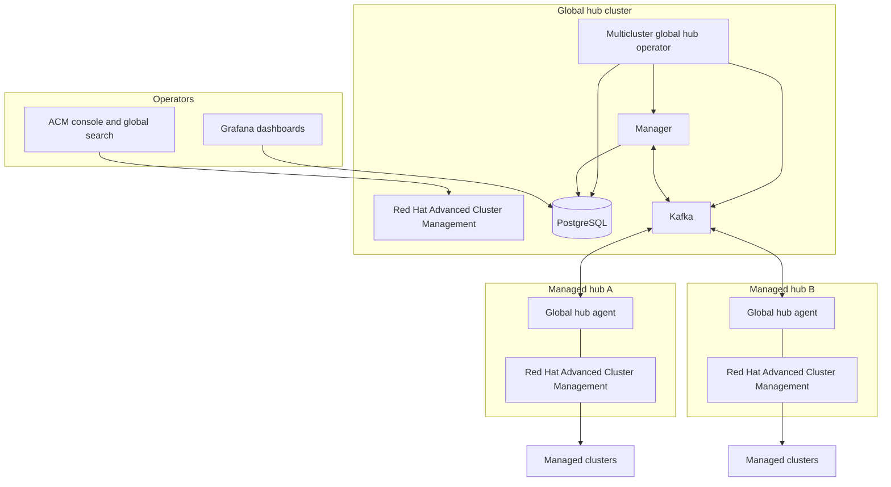
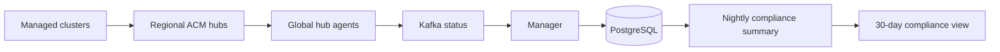
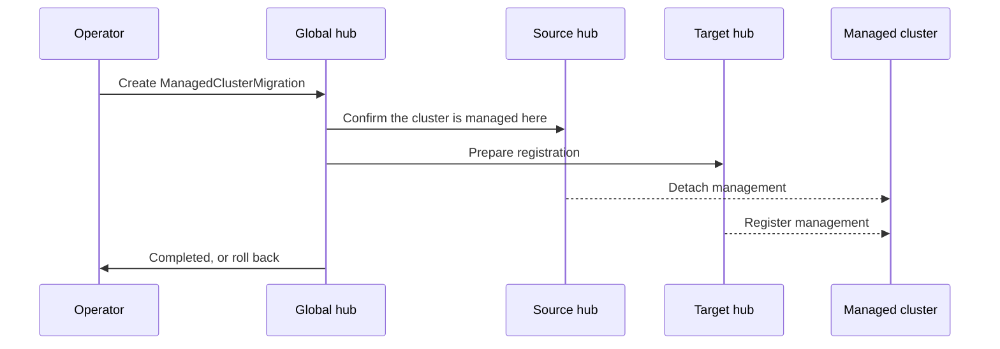

# Fleet management across regional hubs with Multicluster Global Hub

**Status:** Draft for review ([ACM-47281](https://redhat.atlassian.net/browse/ACM-47281), parent [ACM-45720](https://redhat.atlassian.net/browse/ACM-45720))
**Proposed catalog type:** Solution Architecture
**Products:** Red Hat Advanced Cluster Management for Kubernetes, Red Hat OpenShift
**Deployment:** On-premise, cloud, hybrid
**Audience:** Consulting, Global Support, field teams, TAMs, and customer architects

This draft is written in the shape of a Red Hat Architecture Center portfolio page. Diagrams below are logical stand-ins. Replace them with the product architecture figures before publication.

Catalog card summary: Manage a fleet that has outgrown a single hub by placing regional Red Hat Advanced Cluster Management hubs under one global hub, with a shared inventory, policy view, and a path to move clusters between hubs.

---

## Use case

A platform team that starts with one Red Hat Advanced Cluster Management hub eventually runs into the limits of that hub. The limit depends on the mix of policies, applications, add-ons, and cluster count, and it shows up as API server latency, slow policy enforcement, and hubs that cannot take more clusters. The usual response is another hub for another region, business unit, or environment. Each new hub solves local scale and creates a new problem: nobody can see the fleet in one place, and moving a cluster from a busy hub to a quiet one is a project of its own.

Multicluster Global Hub is the architecture for that fleet. One global hub cluster coordinates many managed hub clusters. Each managed hub continues to manage its own clusters with Red Hat Advanced Cluster Management. The global hub aggregates what those hubs know, distributes selected desired state back out to them, and gives operators one place to look.

### Who this is for

Platform and fleet teams that already run more than one Red Hat Advanced Cluster Management hub, or that can see a single hub approaching its practical limit.

Security and compliance teams that need a fleet-level view of policy compliance over time, with the ability to drill into a regional hub for the event that caused a miss.

Operations teams that need to add hub capacity by bringing another hub online, or to rebalance an existing fleet by moving managed clusters from one hub to another.

### Industry verticals

The pattern shows up wherever a Kubernetes estate is split across regions, regulatory boundaries, or business units.

Telecommunications and edge: many hub clusters close to the workload, with a central view of cluster inventory and policy compliance.

Financial services and the public sector: separate hubs for environments that must stay apart, with a controlled aggregate view for audit and corporate controls.

Manufacturing and retail: regional or plant-level hubs, with headquarters reporting that does not require logging into every hub.

Any large OpenShift estate: a single hub is the right start. This architecture is the next step when that hub is no longer enough.

---

## Background

Red Hat Advanced Cluster Management manages a set of OpenShift clusters from a hub. Policies, applications, and cluster lifecycle stay on that hub. That model is the right one until the hub itself becomes the bottleneck, or until the organization already has several hubs and needs them to behave like one fleet.

Adding hubs without a coordination layer leaves three gaps:

- Inventory and compliance are trapped on each hub. A report across production clusters means visiting every hub, or building a custom export.
- Desired state drifts. The same policy intent has to be applied hub by hub.
- Capacity is static. A busy hub and an idle hub stay that way unless someone rebuilds cluster registration by hand.

Multicluster Global Hub closes those gaps without replacing the regional hubs. The regional hub remains the management endpoint for its clusters. The global hub is an additional cluster, which can be a hub that already exists, that runs the global hub operator and imports the other hubs as managed hubs.

---

## Solution overview

The architecture has two roles.

**Global hub cluster.** This is where the management view lives. The multicluster global hub operator installs the manager, Grafana, and the provided Kafka and PostgreSQL, unless you bring your own. Red Hat Advanced Cluster Management also runs here. The global hub does not have to be a cluster that exists only for this purpose.

**Managed hub clusters.** Each one is a Red Hat Advanced Cluster Management hub that also runs the multicluster global hub agent. The agent is the client. It reports cluster and policy information up to the global hub, and it applies policy and application state that the global hub sends down. The managed hub keeps managing its own clusters.

Kafka carries the data between the global hub and the agents. PostgreSQL on the global hub stores it. Grafana reads that database and is the fleet dashboard. Daily compliance summarization turns the raw policy events into a per-day compliant, non-compliant, or pending result so a 30-day report is a trend, not a pile of events.

Figure 1. Logical view. Regional hubs keep managing their clusters. The global hub aggregates status and distributes selected desired state through Kafka.

### What moves, and in which direction

**Up, from managed hubs to the global hub.** The agent watches the managed hub and sends cluster inventory and policy compliance. The manager stores that in PostgreSQL. Grafana and the compliance summary read it there.

**Down, from the global hub to managed hubs.** The manager publishes policy and application desired state. Each agent applies that state on its managed hub. The managed hub then enforces it on its own clusters the same way it always has.

A nightly job on the global hub summarizes the previous day. For a policy on a cluster, the summarized state follows the day's events: a compliant cluster that saw a non-compliant event is summarized as non-compliant for that day; a day that ended non-compliant stays non-compliant; pending stays pending. That summary is what a 30-day controls report is built from.

---

## Prerequisites and minimum viable configuration

| Requirement | Guidance |
|---|---|
| Global hub cluster | A Red Hat OpenShift cluster running Red Hat Advanced Cluster Management. A dedicated cluster is optional. |
| Managed hubs | One or more additional Red Hat Advanced Cluster Management hubs, imported by the global hub. |
| Versions | Match the multicluster global hub release to the Red Hat Advanced Cluster Management release on the hubs. The ACM 2.16 documentation lists ACM 2.14, 2.15, and 2.16, including Arm, IBM Z, and IBM Power Systems, as supported for both the global hub and managed hubs. Confirm the matrix for the release you publish. |
| Access | `cluster-admin` on each cluster. On OpenShift Dedicated, `dedicated-admin` is not sufficient to create the namespaces this install needs. |
| Network | Browsers reach Grafana on HTTPS 443. The manager reaches Kafka and PostgreSQL. Each agent reaches the Kafka route. Managed hubs also need the usual Red Hat Advanced Cluster Management networking. |
| Middleware | Built-in Streams for Apache Kafka, PostgreSQL, and Grafana are installed by the operator. You can integrate existing Kafka, PostgreSQL, and Grafana instead. |
| Sizing | Size each hub with the Red Hat Advanced Cluster Management sizing guidance. The global hub adds manager, database, Kafka, and Grafana capacity on top of the hub it runs on. |

A minimum deployment is one global hub and two managed hubs, with the built-in middleware, in a connected environment. Disconnected install is supported and uses the mirrored operator catalog. Hosted-mode import of a managed hub is a second import path beside the default mode.

---

## The technology

**Multicluster global hub operator.** Installs and reconciles the global components on the global hub, and places the agent on each managed hub. It also owns the database schema and component readiness on the `MulticlusterGlobalHub` custom resource.

**Manager.** Runs only on the global hub. It writes status into PostgreSQL and publishes desired state to Kafka so managed hubs can catch up.

**Agent.** Runs on each managed hub, in the `multicluster-global-hub-agent` namespace. It is the synchronization point between that hub and the global hub.

**Kafka.** The transport. Built-in Kafka uses a spec stream toward all agents and a status stream back from each hub. With your own Kafka, status can share one topic. Agents authenticate with a transport secret.

**PostgreSQL.** System of record for fleet inventory, current compliance, raw events, and the daily compliance history. Retention is set on the `MulticlusterGlobalHub` custom resource. Built-in PostgreSQL 16 is the default. An existing PostgreSQL database can be integrated.

**Grafana.** Fleet visualizations, with PostgreSQL as the data source, exposed by the `multicluster-global-hub-grafana` route. Grafana alerting is a Technology Preview.

**Red Hat Advanced Cluster Management.** Still does the cluster management. The global hub uses it to reach managed hubs and to distribute the agent. Policies and applications that the agent syncs are enforced by the managed hub, not by a second control loop on the clusters.

| Namespace | Where | What runs there |
|---|---|---|
| `multicluster-global-hub` | Global hub | Operator, manager, PostgreSQL, Kafka, Grafana |
| `multicluster-global-hub-agent` | Each managed hub | Agent |
| `open-cluster-management` | Global hub and managed hubs | Red Hat Advanced Cluster Management |

---

## Architectures

Three deployments cover the reasons people adopt this pattern. They stack: most fleets want the view first, then add hubs for scale, then move clusters when the balance is wrong.

### Fleet compliance across regional hubs

Use this when the hubs already exist and the missing piece is one report.

Each managed hub already enforces policy on its clusters. Agents ship compliance events to the global hub. The manager keeps the current state and the event history. The nightly summary produces one result per policy per cluster per day. Grafana shows the trend. An auditor who needs the underlying event follows it back to the managed hub that owns the cluster. The global hub is the index and the history, and the managed hub remains the system of record for live enforcement.

Figure 2. Compliance path. Live enforcement stays on the regional hub. The global hub stores events and the daily summary.

### Scale out by adding a managed hub

Use this when a hub is near its limit and the next clusters should land on a new hub.

Install or designate a global hub, import the existing hubs, and import the new hub the same way. New clusters register to the new hub only. They show up in the global inventory and compliance view because the new hub runs an agent. Existing clusters stay where they are. This is horizontal scale of the management plane: add a hub, rather than growing the original hub without bound.

### Rebalance by moving clusters between hubs

Use this when one hub is hot and another has room, or when a cluster should move to a hub in its region.

Managed cluster migration coordinates the move from the global hub. You select clusters directly, or by a placement, and a `ManagedClusterMigration` resource moves them from the source hub to the target hub. The same mechanism supports zero-touch provisioning migration of `ClusterInstance` applications, with a prepare, verify, migrate, and roll-back sequence. Migration is documented as a Technology Preview in the ACM 2.16 multicluster global hub guide. Call that out on the published page until the support statement changes.

Figure 3. Moving a managed cluster between hubs. The global hub coordinates. The cluster workload stays in place. What moves is which hub manages it.

---

## Technology Preview, called out separately

These are part of the product story and are still Technology Preview in the ACM 2.16 documentation. The portfolio page should say so.

- **Global search.** One search across the hubs, enabled by annotating the search operator with `global-search-preview=true`.
- **Backup and restore.** Use Red Hat Advanced Cluster Management backup and restore for the global hub, including backup of the PostgreSQL persistent volume. On restore, install the operator and let the custom resource come back from backup rather than recreating it by hand.
- **Grafana alerting.** Alert rules on the global hub dashboards.
- **Managed cluster migration.** The rebalance flow in the previous section.

---

## What this architecture leaves on the managed hub

Regional hubs remain Red Hat Advanced Cluster Management hubs. Cluster lifecycle, policy enforcement on the clusters, and application delivery to those clusters stay with the hub that owns them. The global hub coordinates the hubs and holds the aggregate. Drill-down for a single non-compliant event is a hop to the managed hub that reported it.

---

## Contributors

| Name | Role |
|---|---|
| Mihir Lele | Draft |
| Sushilkumar Deshmukh | Reviewer, requester |
| Bradd Weidenbenner | Reviewer. Existing Global Hub architecture slides are the precedent for this page. |

---

## What's next

1. Review this draft against the architecture slides Bradd linked from ACM-45720 and swap any figure that those slides already tell more clearly.
2. Confirm the version matrix for the release this page should describe, including the Global Hub 5.0 line tracked by ACM-35124.
3. Replace the mermaid figures with the architecture and data-flow diagrams used in the product docs.
4. Submit the page to the Red Hat Architecture Center as a Solution Architecture under Red Hat Advanced Cluster Management for Kubernetes.

## Learn more

- [Multicluster global hub, Red Hat Advanced Cluster Management 2.16](https://docs.redhat.com/en/documentation/red_hat_advanced_cluster_management_for_kubernetes/2.16/html-single/multicluster_global_hub/index)
- [Rebalance hub workloads with managed cluster migration](https://developers.redhat.com/articles/2026/03/19/rebalance-hub-workloads-managed-cluster-migration)
- In-repo architecture for reviewers: [docs/ARCHITECTURE.md](../../docs/ARCHITECTURE.md) and [doc/how_global_hub_works.md](../how_global_hub_works.md)
